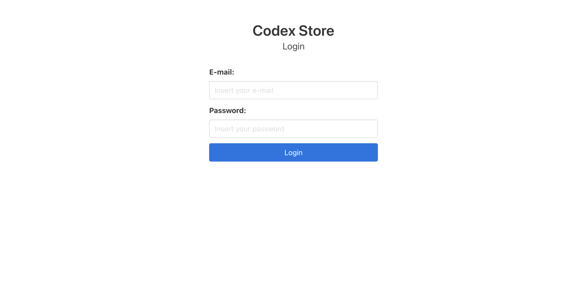
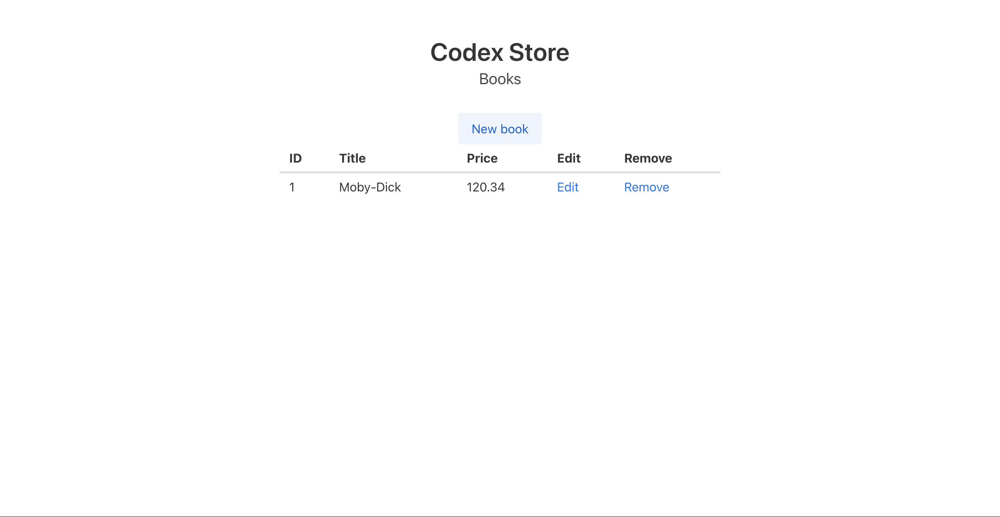
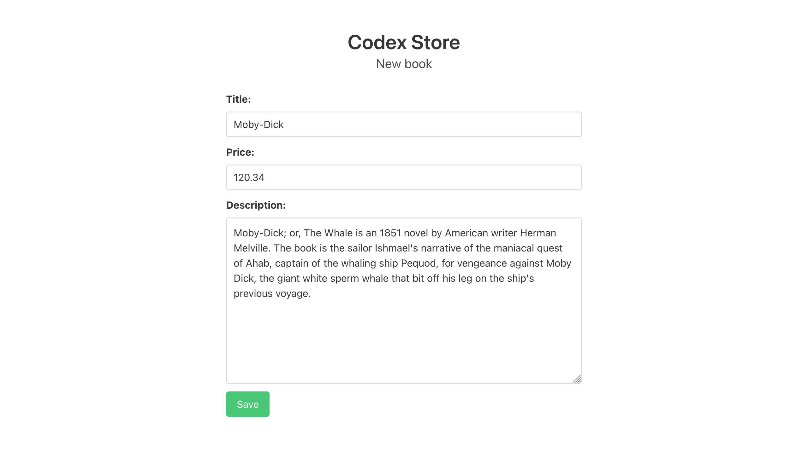

# Codex Store

> A book store

This project is the result of the following [Alura](https://www.alura.com.br)'s `NodeJs` courses:

* [Node.js Parte 1: Inovando com JavaScript no backend](https://www.alura.com.br/curso-online-nodejs-fundamentos)
* [Node.js Parte 2: MVC, autenticação e autorização](https://www.alura.com.br/curso-online-node-mvc-autenticacao-autorizacao)

**Note**: I did not follow the course contents strictly, so my implementation will differ from the code shown during the course.

## Images

*Login page*

*Book listing*

*Book detail*
